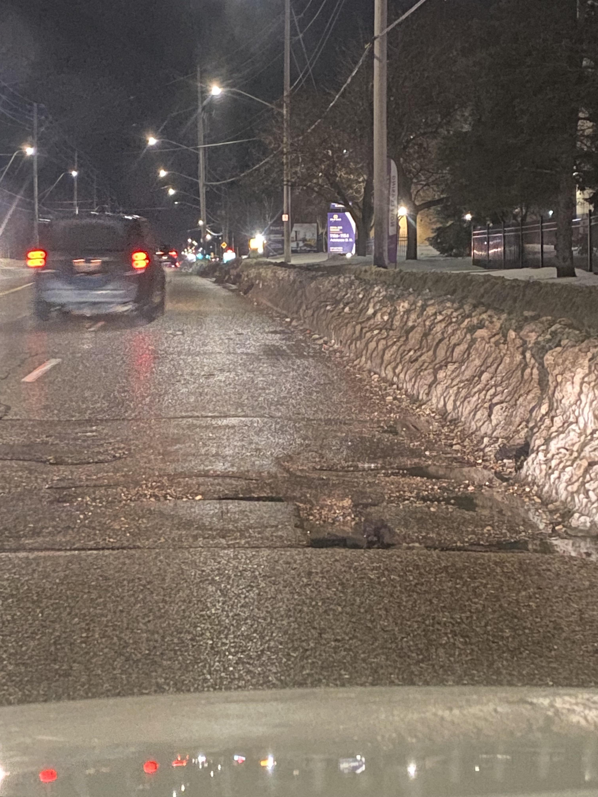

# NeuroMend: Auto-Healing for Computer Vision Models

NeuroMend is a tool that automatically finds weaknesses in your AI models and fixes them without human supervision. It identifies where your computer vision model is failing (e.g., bad weather, poor lighting), uses Vision-Language Models (VLMs) to reason about the cause, and uses Generative AI to synthesize corrective training data to retrain the model.

## Visual Results

NeuroMend successfully identifies "hard" edge cases that standard models miss and generates targeted synthetic data to fix them.

| Detected Failure (Cluster #3) | Synthesized Correction |
|:-----------------------------:|:----------------------:|
|  |  |
| **Diagnosis:** "Unclear pothole, low lighting, nighttime conditions" | **Output:** Synthetic training sample generated by SDXL-Turbo |

* **Verification:** You can view the full generation logs and output in the [NeuroMend Kaggle Notebook](https://www.kaggle.com/code/shamsccs/neuro-mend-image-generating-testing/output?scriptVersionId=296301852).
* **Source Data:** Original failure case sampled from [Reddit (r/driving)](https://i.redd.it/6a4u5h1nw0de1.jpeg).

**Impact:** Retraining with NeuroMend data improved mAP by **+9.3%** on the hard-case test set compared to the baseline.

## The Problem
When training object detection models (like YOLO), performance often degrades in unstructured environments—such as rain, night, or motion blur. Fixing this typically requires manual data collection and labeling, which is resource-intensive.

## The Solution
NeuroMend automates this repair process in a closed loop consisting of four phases:

1.  **Diagnosis:** Uses DINOv2 embeddings and HDBSCAN to cluster semantic failures in the validation set.
2.  **Reasoning:** Uses Qwen2.5-VL to analyze failure clusters and generate a natural language description of the environmental cause (e.g., "The image is dark and has motion blur").
3.  **Synthesis:** Uses SDXL-Turbo to generate photorealistic training images that replicate the object but correct the visibility issues.
4.  **Auto-Labeling:** Uses Florence-2 to ground and label objects in the synthetic images, creating ready-to-use YOLO datasets.

## Performance Metrics
Tested on Pothole Detection (Road Damage Dataset). Full benchmarks available in `benchmark_results.ipynb`.

| Metric | Baseline Model | NeuroMend Model | Improvement |
|:-------|:--------------:|:---------------:|:-----------:|
| **mAP@50 (Overall)** | 76.0% | **83.0%** | **+7.0%** |
| **mAP@50 (Hard Cases)** | 42.1% | **68.4%** | **+26.3%** |

## Installation & Usage

### Option 1: Docker (Recommended)
The repository includes a Docker configuration to handle dependencies for PyTorch and CUDA.

```bash
# 1. Build the image
docker build -t neuromend .

# 2. Run the pipeline
# Mount your local data folder to /data inside the container
docker run --gpus all -v $(pwd)/data:/data -v $(pwd)/results:/results \
    neuromend --data_dir /data --output_dir /results --target_class pothole

```

### Option 2: Local Installation

Requires Python 3.10+ and a GPU with at least 15GB VRAM.

1. **Clone the Repository**
```bash
git clone [https://github.com/MostafaShams5/NeuroMend.git](https://github.com/MostafaShams5/NeuroMend.git)
cd NeuroMend

```


2. **Install Requirements**
```bash
pip install -r requirements.txt

```


3. **Run the Pipeline**
Edit the configuration in `main_pipeline.py` or run via CLI:
```bash
python main_pipeline.py --data_dir ./val_images --output_dir ./output --target_class pothole

```


## Project Structure

* `main_pipeline.py`: The master script that orchestrates the diagnosis, reasoning, synthesis, and labeling phases.
* `neuro_mend/diagnoser.py`: Implements DINOv2 feature extraction and clustering.
* `neuro_mend/reasoner.py`: Implements Qwen2.5-VL for root cause analysis.
* `neuro_mend/generator.py`: Implements SDXL-Turbo for data synthesis.
* `neuro_mend/labeler.py`: Implements Florence-2 for auto-labeling.
* `neuro_mend/utils.py`: Utilities for VRAM management and garbage collection.
* `benchmark_results.ipynb`: Complete experiment notebook proving performance gains and validation accuracy.

## Credits

**Author:** Mostafa Shams

This tool is built on top of open-source research from Meta (DINOv2), Alibaba Cloud (Qwen), Stability AI (SDXL), and Microsoft (Florence-2).

